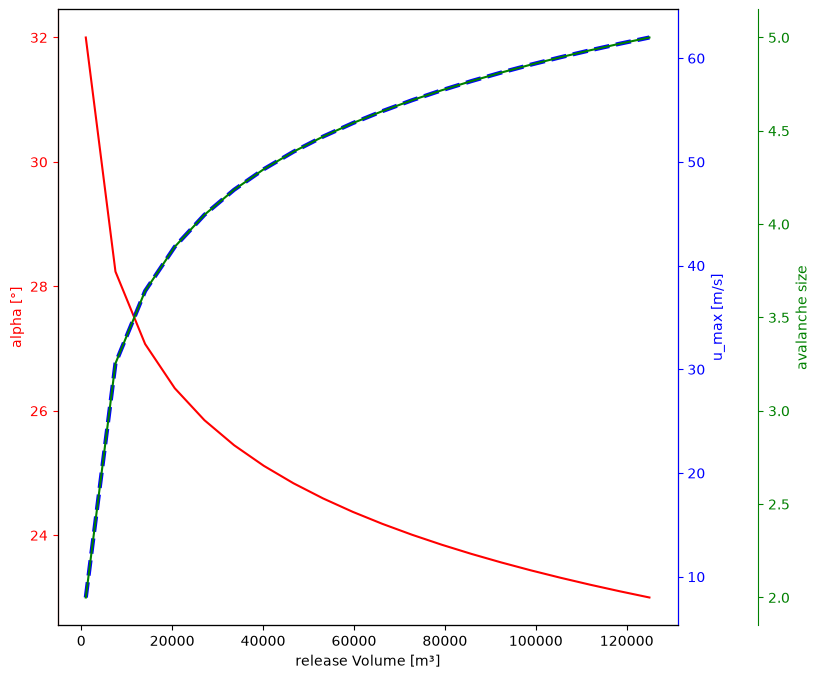
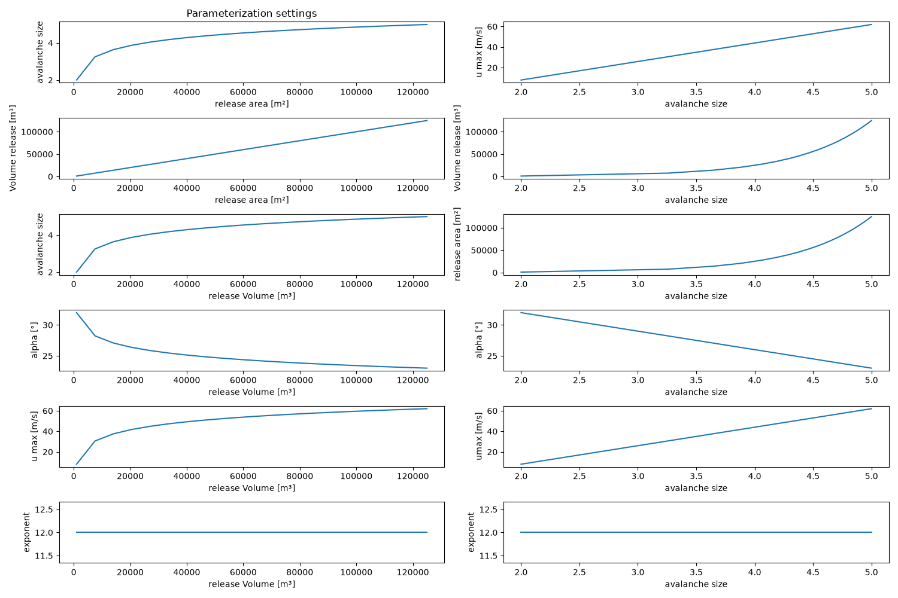

# Module `mod2Mobility`

## Overview

The mod2Mobility module provides tools that derive the mobility parameters required by avalanche mobility simulation
tools such
as [AvaFrame::com4FlowPy]([AvaFrame::com4FlowPy](https://docs.avaframe.org/en/latest/moduleCom4FlowPy.html#)), and,
conversely, tools to translate com4FlowPy simulation results back into an avalanche size for interpretation. Both
directions are based on the same underlying avalanche-size parameterization, which depends on the release area and,
optionally, on the local snow climate.

## `compParams`

The module provides two entry points, implemented in `compParams.py`:

- **`computeAndSaveParameters`**: derives the mobility parameters `alpha`, `umax` and `exp`
  for each release area, to be used as `com4FlowPy` input.
- **`computeAndSaveSize`**: converts `com4FlowPy` simulation results back into an avalanche size raster, to help
  interpret the simulation output.

The underlying relationships are based on the avalanche size classifications
of [EAWS](https://www.avalanches.org/standards/avalanche-size/), [CAA](https://avysavvy.avalanche.ca/en-ca/avalanche-sizes)
and [AAA](https://avalanche.org/avalanche-encyclopedia/avalanche/avalanche-problems/avalanche-size/).

Configuration parameters can be adjusted in `(local_)compParamsCfg.ini`.

---

## `computeAndSaveParameters` — Deriving the Mobility Parameters

For each release area, `computeAndSaveParameters` performs the following steps:

1. Compute the release thickness, either from the snow climate or as a constant value.
2. Compute the continuous avalanche size from the release volume, optionally capped by `sizeMax`.
3. Derive the mobility parameters `alpha`, `umax` and `exp` from the size, optionally shifted by a temperature-dependent
   wet/dry blend.

### 1. Release Thickness

The release thickness can either be set to a constant value (`constantPraThickness = True`), or computed from the snow
climate as a linear function of elevation `z`, using a reference thickness `D0` and a snow-depth gradient
`deltaD`:

```
thickness(z) = D0 + deltaD · z
```

`D0` (thickness at `z = 0`) and `deltaD` (change in thickness per unit elevation, e.g. `10 cm / 100 m` in an Alpine snow
climate) can both be adjusted in the configuration file.

### 2. Release Volume and Avalanche Size

A raster layer containing the release areas (in m²) is required (`Inputs/RelArea`). Given the release area `Arel`
and the thickness from Step 1, the release volume `Vrel` follows as:

```
Vrel = Arel · thickness
```

The avalanche size is the continuous quantity on the same scale as the EAWS/CAA/AAA size classes (from `1` -
`5`). It is linked to this volume through the same empirical relationship as before:

```
Vrel = 5^(size - 2) · 1000
size = 2 + log5( Arel · thickness · 10⁻³ )
```

### 4. Mobility Parameters: `alpha`, `umax`, `exp`

From the avalanche size, the three Flow-Py mobility parameters are computed. All three optionally depend on a
temperature-based wet/dry blend of the size, see
[Temperature-Dependent Wet/Dry Parameterization](#temperature-dependent-wetdry-parameterization) below.

#### runout angle `alpha`

`alpha` controls the stopping of the flow path: a smaller `alpha` allows the avalanche to travel farther.

```
alpha(size) = alphaSize2 - (size - 2) · deltaAlpha
```

where `alphaSize2` is `alpha` at `size = 2`, and `deltaAlpha` is the change in `alpha` per unit increase in size. Both
parameters can be adjusted via the corresponding entries in the configuration file.

#### maximum velocity limit `umax`

`umax` (or `umaxlim`) is the upper velocity limit a process can have.

```
umax(size) = uMaxSize2 + (size - 2) · deltaUMax
```

where `uMaxSize2` is `umax` at `size = 2`, and `deltaUMax` is the change in `umax` per unit increase in size. Both
parameters can be adjusted via the configuration file.

#### exponent `exp`

> **Hint:** compared to `alpha` and `umax`, the parameterization of `exp` is used far less and is less
> well understood; treat the formulas below with corresponding caution.

`exp` controls the lateral spread of the flow path: a larger `exp` produces a narrower flow.

```
exp(size) = expCoeff · expBase^size
```

with default values `expCoeff = 75` and `expBase = 0.64`. Both can be adjusted via the configuration file.

If `constantExp is True`: `exp` is set to a fixed raster value `constantExpValue`.

#### Default setting

The Figures show various relationships of the default setting:




The figures can be created for the own parameter configuration with:

``` 
python workflows/runPlotParameterisation.py 
```

---

## Wet-Snow Avalanches

For **wet** avalanches, the parameters are derived from the dry-avalanche relationships above, using a shifted avalanche
size:

```
alpha_wet(size) = alpha_dry(size + sizeShiftAlpha)
umax_wet(size)  = umax_dry(size + sizeShiftUmax)
exp_wet(size)   = exp_dry(size + sizeShiftExp)
```

The shifts are configurable via `sizeShiftAlpha`, `sizeShiftUmax` and `sizeShiftExp`, with default values
`sizeShiftAlpha = 0.5`, `sizeShiftUmax = -0.75` and `sizeShiftExp = 0.5`.

Two additional rules apply:

- **Lower bound on `umax`:** any computed value below `5 m/s` is clamped to `5 m/s`.
- **Upper bound on size:** avalanche sizes larger than `4` are treated as `size = 4` when computing the mobility
  parameters (i.e. the parameters saturate at the size-4 values).

### Temperature-Dependent Wet/Dry Parameterization

> **Note:** this temperature-dependent parameterization represents an initial idea and has not yet been fully
> tested or validated; it should be complemented and verified before being relied on for using.


Rather than a fixed offset between "dry" and "wet" avalanches, `mod2Mobility` can blends between a cold/dry and a
warm/wet parameterization continuously, based on an elevation-derived temperature.

**Temperature profile** (`zToTemp`): temperature is either constant (`constantTemperature = True`, using
`Tcons`), or a linear function of elevation:

```
temp(z) = T0 + deltaT · z
```

clamped between the configured cold and warm limits `TCold` and `TWarm`.

**Shifted size** (`sizeForParameterisation`): for a given parameter (`alpha`, `umax` or `exp`), the size used in that
parameter's formula is shifted linearly between the reference size (at `TCold`, i.e. the "dry" case) and the size plus
the parameter's maximum shift (at `TWarm`, i.e. the fully "wet" case):

```
sizeTemp = size + (temp - TCold) · sizeShift / (TWarm - TCold)
```

where `sizeShift` is `sizeShiftAlpha`, `sizeShiftUmax` or `sizeShiftExp`, respectively.

This shift is always applied for `umax`, and for `exp` in its size-dependent mode; for `alpha` (and for `exp` in its
constant mode) it is applied only if `alphaDependendTemperature = True`.


---

## `computeAndSaveSize`: Avalanche Size from Simulation Results

`computeAndSaveSize` performs the inverse mapping: it converts one or more `com4FlowPy` result rasters back into an
avalanche-size raster, which can help evaluate or interpret simulation results in terms of avalanche size.

The variables to convert are configured via `resParamsToSize` (a `|`-separated list, e.g.
`zDelta|fpTravelAngleMax|travelLength`). For each configured variable, the matching `com4FlowPy` output raster (s)
for the given `avaDir` (and, if provided, `flowPyUid`) are located, and converted as follows (`0` and `-9999`
values in the input raster are treated as nodata):

| Result variable                                         | Conversion                                                                                                                                                           |
|---------------------------------------------------------|----------------------------------------------------------------------------------------------------------------------------------------------------------------------|
| `zDelta`                                                | `uMaxSim = sqrt(2 · 9.81 · zDelta)`, then inverted via the `umax(size)` relationship (without the temperature shift): `size = (uMaxSim − uMaxSize2) / deltaUMax + 2` |
| `fpTravelAngleMax`, `fpTravelAngleMin`, `fpTravelAngle` | Inverted via the `alpha(size)` relationship (without the temperature shift): `size = −(alphaSim − alphaSize2) / deltaAlpha + 2`                                      |
| `travelLength`, `travelLengthMax`, `travelLengthMin`    | Empirical relationship: `size = (travelLength / 4.5)^(1/4)`                                                                                                          |

Each resulting size raster is saved next to the corresponding simulation-result raster, in a `Size` subfolder, with
`_sized` appended to the original file name.

> **Note:** the `zDelta` and travel-angle conversions use the base (cold/dry) `alpha`/`umax` relationships and do
> not account for the temperature-dependent wet/dry shift described above.
 
---

## Input Files

`computeAndSaveParameters` requires a digital elevation model and a raster containing the release area, provided in the
following structure:

```text
<avaDir>/
└── Inputs/
    ├── digital elevation model (*.tif or *.asc)
    └── RELArea/
        └── release areas in m² (.tif or *.asc)
```

`computeAndSaveSize` additionally requires the corresponding `com4FlowPy` result rasters (e.g. under
`Outputs/com4FlowPy/peakFiles/res_<flowpyHash>`) for the variables listed in `resParamsToSize`.

```text
<avaDir>/
└── Outputs/
    ├── com4FlowPy/
        └── peakFiles/
            └── res_<flowpyHash>/   # com4FlowPy simulation results (Step 3)
                └── FlowPy result raster (*.asc or *.tif)
```

## Output Files

The parameterization files are saved within the following folder structure, so that a dynamic parameterization can be
run with
[AvaFrame::com4FlowPy](https://docs.avaframe.org/en/latest/moduleCom4FlowPy.html#iv-variable-parameters):

```text
<avaDir>/
└── Outputs/
    ├── ALPHA/
    │   └── alpha.tif
    ├── UMAX/
    │   └── umax.tif
    └── EXP/
        └── exp.tif
```

`computeAndSaveSize` saves each converted size raster alongside its source simulation raster, in a `Size`
subfolder, e.g.:

```text
.../res_<flowpyHash>/
      └── Size/
          └── <result>_sized.tif
```

---

Go back to [main documentation](../../README.md).
